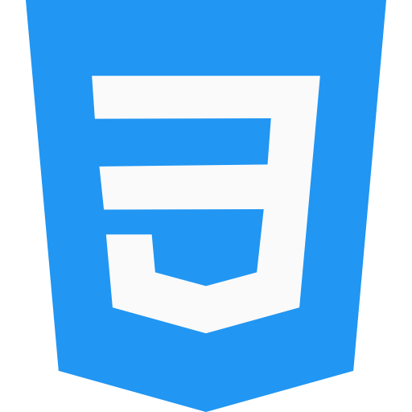

# Frontend Mentor - Interactive rating component

## Bem-vindo! 👋

Este é mais um projeto do Frontendmentor para praticar as habilidades de HTML, CSS e JavaScript.

O JavaScript foi usado para identificar o estado ativo dos botões, trocar a tela após a avaliação do usuário e confirmar ao usuário qual foi a nota dada.
Com esse projeto tive um contato maior com JavaScript além da teoria, compreendendo melhor como criar variáveis e como utlizá-las para tornar o código mais legível.

Essa linguagem é realmente poderosa, como já ouvi muito falar antes de começar a entendê-la, e com certeza esse desafio me instigou a continuar aprendendo e trazendo soluções cada vez elaboradas.

### Design Desktop

### Design Mobile

### Tecnologias

### Link

<a href="https://als-samara.github.io/interactive-rating-component/">Live site URL</a>

#### Contato

Tem dúvidas ou quer conversar sobre esse ou outros projetos? Redes para contato:

 
  
   
    

